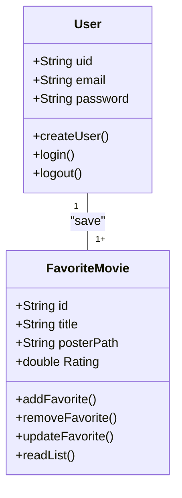
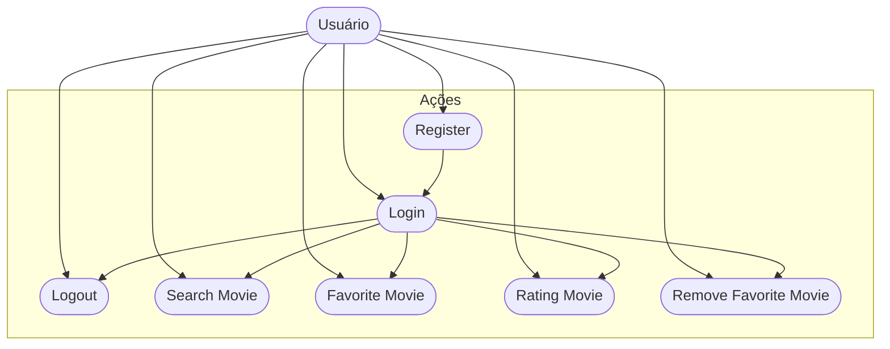

# CineFavorite - Formativa
Construir um Aplicativo do Zero - O CineFavorite permitirá criar uma conta e buscar filmes em uma API e montar uma galeria pessoal de filmes favoritos, com posters e notas

## Objetivos
- Criar uma galeria personalizada por Usuário de Filmes Favoritos
- Conectar o APP com uma API(Base de Dados) de Filmes
- Permitir a criação de contas para cada usuário
- Listar Filmes por Palavra-Chave

## Levantamento de Requisitos do Projeto
- ## Funcionais

- ### não Funcionais

## Recursos do Projeto
- Flutter/Dart
- FireBase( Authentication / FireStore DataBase)
- API TMDB
- Figma
- VsCode

## Diagramas

1. ### Classes
    Demonstrar o funcionamento das Entidades do Sistema
    - Usuário (User) : classe já modela pelo FirebaseAuth
        - email
        - password
        - uid
        - login()
        - create()
        - logout()

    - FilmeFavorito: Classe Modelada pelo DEV
        - number:id
        - String: Título
        - String: Poster
        - double: Rating
        - adicionar()
        - remover()
        - listar()
        - updateNota()



2. ### Uso
    Ações que os Atores pode Fazer
    - User:
        - Registrar
        - Login
        - Logout
        - Procurar Filmes API
        - Salvar Filmes Favoritos
        - Dar Nota aos Filmes
        - Remover dos Favoritos



3. ### Fluxo
    Determina o caminho percorrido pelo autor para executar uma ação

    - Ação de Login

    ```mermaid

    graph TD

A[Ínicio] --> B{Login Usuário}
    B --> C[Inserir Email e Senha] 
    C --> D{Validar as Credenciais}
    D --> E[Sim]
    E --> F[Tela de Favoritos]
    D --> G[Não]
    G --> B

    ```

## Prototipagem

Figma - https://www.figma.com/design/KtVMtTBs0pNv7CACwkOyH0/Untitled?node-id=3-5&t=DDMUSY9ToJcXmob5-0

## Codificação